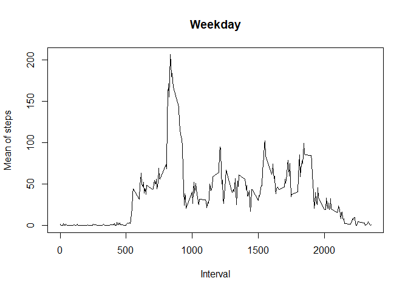

## Loading and preprocessing the data
First of all let's load part the data. This table contains more than 17000 entries, so we will take a look at the first 20:

```r
activity_table <- read.csv("activity.csv")
head(activity_table,20)
```

```
##    steps       date interval
## 1     NA 2012-10-01        0
## 2     NA 2012-10-01        5
## 3     NA 2012-10-01       10
## 4     NA 2012-10-01       15
## 5     NA 2012-10-01       20
## 6     NA 2012-10-01       25
## 7     NA 2012-10-01       30
## 8     NA 2012-10-01       35
## 9     NA 2012-10-01       40
## 10    NA 2012-10-01       45
## 11    NA 2012-10-01       50
## 12    NA 2012-10-01       55
## 13    NA 2012-10-01      100
## 14    NA 2012-10-01      105
## 15    NA 2012-10-01      110
## 16    NA 2012-10-01      115
## 17    NA 2012-10-01      120
## 18    NA 2012-10-01      125
## 19    NA 2012-10-01      130
## 20    NA 2012-10-01      135
```
Then, let's take a look at the summary of all of the data:


```r
summary(activity_table)
```

```
##      steps            date              interval     
##  Min.   :  0.00   Length:17568       Min.   :   0.0  
##  1st Qu.:  0.00   Class :character   1st Qu.: 588.8  
##  Median :  0.00   Mode  :character   Median :1177.5  
##  Mean   : 37.38                      Mean   :1177.5  
##  3rd Qu.: 12.00                      3rd Qu.:1766.2  
##  Max.   :806.00                      Max.   :2355.0  
##  NA's   :2304
```
## What is mean total number of steps taken per day?
To find the total mean of steps taken per day we first have to calculate the sum of all the steps:

```r
daily_steps <- split(activity_table$steps, activity_table$date)
Steps <- sapply(daily_steps,sum,na.rm=TRUE)
Steps
```

```
## 2012-10-01 2012-10-02 2012-10-03 2012-10-04 2012-10-05 2012-10-06 2012-10-07 
##          0        126      11352      12116      13294      15420      11015 
## 2012-10-08 2012-10-09 2012-10-10 2012-10-11 2012-10-12 2012-10-13 2012-10-14 
##          0      12811       9900      10304      17382      12426      15098 
## 2012-10-15 2012-10-16 2012-10-17 2012-10-18 2012-10-19 2012-10-20 2012-10-21 
##      10139      15084      13452      10056      11829      10395       8821 
## 2012-10-22 2012-10-23 2012-10-24 2012-10-25 2012-10-26 2012-10-27 2012-10-28 
##      13460       8918       8355       2492       6778      10119      11458 
## 2012-10-29 2012-10-30 2012-10-31 2012-11-01 2012-11-02 2012-11-03 2012-11-04 
##       5018       9819      15414          0      10600      10571          0 
## 2012-11-05 2012-11-06 2012-11-07 2012-11-08 2012-11-09 2012-11-10 2012-11-11 
##      10439       8334      12883       3219          0          0      12608 
## 2012-11-12 2012-11-13 2012-11-14 2012-11-15 2012-11-16 2012-11-17 2012-11-18 
##      10765       7336          0         41       5441      14339      15110 
## 2012-11-19 2012-11-20 2012-11-21 2012-11-22 2012-11-23 2012-11-24 2012-11-25 
##       8841       4472      12787      20427      21194      14478      11834 
## 2012-11-26 2012-11-27 2012-11-28 2012-11-29 2012-11-30 
##      11162      13646      10183       7047          0
```
We then plot the histogram of the steps:

```r
hist(Steps)
```

<!-- -->

And,as a final step, we calculate the total mean:

```r
mean(Steps)
```

```
## [1] 9354.23
```
## What is the average daily activity pattern?
To calculate the average daily activity pattern we start by associating the "steps" column with the "interval" column:

```r
i <- as.numeric(sapply(split(activity_table$steps, activity_table$interval),mean, na.rm=TRUE))
head(i,50)
```

```
##  [1] 1.7169811 0.3396226 0.1320755 0.1509434 0.0754717 2.0943396 0.5283019
##  [8] 0.8679245 0.0000000 1.4716981 0.3018868 0.1320755 0.3207547 0.6792453
## [15] 0.1509434 0.3396226 0.0000000 1.1132075 1.8301887 0.1698113 0.1698113
## [22] 0.3773585 0.2641509 0.0000000 0.0000000 0.0000000 1.1320755 0.0000000
## [29] 0.0000000 0.1320755 0.0000000 0.2264151 0.0000000 0.0000000 1.5471698
## [36] 0.9433962 0.0000000 0.0000000 0.0000000 0.0000000 0.2075472 0.6226415
## [43] 1.6226415 0.5849057 0.4905660 0.0754717 0.0000000 0.0000000 1.1886792
## [50] 0.9433962
```
Then we represent the time series plot based on the average steps taken:

```r
dim <- unique(activity_table$interval)
plot(dim, i,type="l", xlab="Interval", ylab="Mean of steps")
```

<!-- -->

## Imputing missing values
Up until now we've been ignoring the NA values. We can calculate how many of them we're missing:

```r
NA_counter <- 0
for (n in 1:dim(activity_table)[1]) {
  if (is.na(activity_table$steps[n])) {
    NA_counter <- NA_counter + 1
  }
}
NA_counter
```

```
## [1] 2304
```
To fill these values we are going to replace all the NA's with the mean of their relative 5 minutes interval:

```r
j <- split(activity_table$steps, activity_table$interval)
for (m in 1:length(j)) {
  for (n in 1:length(j[[m]])) {
    if (is.na(j[[m]][n])) {
      j[[m]][n] <- i[m]
    }
  }
}
head(j, 3)
```

```
## $`0`
##  [1]  1.716981  0.000000  0.000000 47.000000  0.000000  0.000000  0.000000
##  [8]  1.716981  0.000000 34.000000  0.000000  0.000000  0.000000  0.000000
## [15]  0.000000  0.000000  0.000000  0.000000  0.000000  0.000000  0.000000
## [22] 10.000000  0.000000  0.000000  0.000000  0.000000  0.000000  0.000000
## [29]  0.000000  0.000000  0.000000  1.716981  0.000000  0.000000  1.716981
## [36]  0.000000  0.000000  0.000000  0.000000  1.716981  1.716981  0.000000
## [43]  0.000000  0.000000  1.716981  0.000000  0.000000  0.000000  0.000000
## [50]  0.000000  0.000000  0.000000  0.000000  0.000000  0.000000  0.000000
## [57]  0.000000  0.000000  0.000000  0.000000  1.716981
## 
## $`5`
##  [1]  0.3396226  0.0000000  0.0000000  0.0000000  0.0000000  0.0000000
##  [7]  0.0000000  0.3396226  0.0000000 18.0000000  0.0000000  0.0000000
## [13]  0.0000000  0.0000000  0.0000000  0.0000000  0.0000000  0.0000000
## [19]  0.0000000  0.0000000  0.0000000  0.0000000  0.0000000  0.0000000
## [25]  0.0000000  0.0000000  0.0000000  0.0000000  0.0000000  0.0000000
## [31]  0.0000000  0.3396226  0.0000000  0.0000000  0.3396226  0.0000000
## [37]  0.0000000  0.0000000  0.0000000  0.3396226  0.3396226  0.0000000
## [43]  0.0000000  0.0000000  0.3396226  0.0000000  0.0000000  0.0000000
## [49]  0.0000000  0.0000000  0.0000000  0.0000000  0.0000000  0.0000000
## [55]  0.0000000  0.0000000  0.0000000  0.0000000  0.0000000  0.0000000
## [61]  0.3396226
## 
## $`10`
##  [1] 0.1320755 0.0000000 0.0000000 0.0000000 0.0000000 0.0000000 0.0000000
##  [8] 0.1320755 0.0000000 7.0000000 0.0000000 0.0000000 0.0000000 0.0000000
## [15] 0.0000000 0.0000000 0.0000000 0.0000000 0.0000000 0.0000000 0.0000000
## [22] 0.0000000 0.0000000 0.0000000 0.0000000 0.0000000 0.0000000 0.0000000
## [29] 0.0000000 0.0000000 0.0000000 0.1320755 0.0000000 0.0000000 0.1320755
## [36] 0.0000000 0.0000000 0.0000000 0.0000000 0.1320755 0.1320755 0.0000000
## [43] 0.0000000 0.0000000 0.1320755 0.0000000 0.0000000 0.0000000 0.0000000
## [50] 0.0000000 0.0000000 0.0000000 0.0000000 0.0000000 0.0000000 0.0000000
## [57] 0.0000000 0.0000000 0.0000000 0.0000000 0.1320755
```
And then we can graph the result:

```r
j <- as.numeric(sapply(j,mean))
plot(dim, j,type="l", xlab="Interval", ylab="Mean of steps")
```

<!-- -->

Based on the plots, there doesn't appear to be any differences if we decided to include all the NAs values.

## Are there differences in activity patterns between weekdays and weekends?
First of all let's define a list of all the days present in the table:

```r
days <- weekdays(as.Date(activity_table$date))
```
Then let's create a Data Frame containing the steps, the 5 minute interval and the days of the week, and let's take the mean of both of them:

```r
daysofweek_dataframe <- data.frame(activity_table$steps, activity_table$interval, days)
weekdays <- daysofweek_dataframe[!daysofweek_dataframe$days=="sabato" | !daysofweek_dataframe$days == "domenica",]
weekend <- daysofweek_dataframe[daysofweek_dataframe$days=="sabato" | daysofweek_dataframe$days == "domenica",]

head(daysofweek_dataframe,5)
```

```
##   activity_table.steps activity_table.interval   days
## 1                   NA                       0 lunedì
## 2                   NA                       5 lunedì
## 3                   NA                      10 lunedì
## 4                   NA                      15 lunedì
## 5                   NA                      20 lunedì
```

```r
head(weekdays)
```

```
##   activity_table.steps activity_table.interval   days
## 1                   NA                       0 lunedì
## 2                   NA                       5 lunedì
## 3                   NA                      10 lunedì
## 4                   NA                      15 lunedì
## 5                   NA                      20 lunedì
## 6                   NA                      25 lunedì
```

```r
head(weekend)
```

```
##      activity_table.steps activity_table.interval   days
## 1441                    0                       0 sabato
## 1442                    0                       5 sabato
## 1443                    0                      10 sabato
## 1444                    0                      15 sabato
## 1445                    0                      20 sabato
## 1446                    0                      25 sabato
```

```r
weekdays_mean <- as.numeric(sapply(split(weekdays$activity_table.steps, weekdays$activity_table.interval),mean, na.rm=TRUE))
weekend_mean <- as.numeric(sapply(split(weekend$activity_table.steps, weekend$activity_table.interval),mean, na.rm=TRUE))
```
We can now plot all the data we got:

<!-- --><!-- -->
